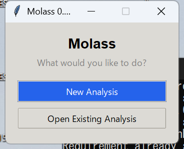
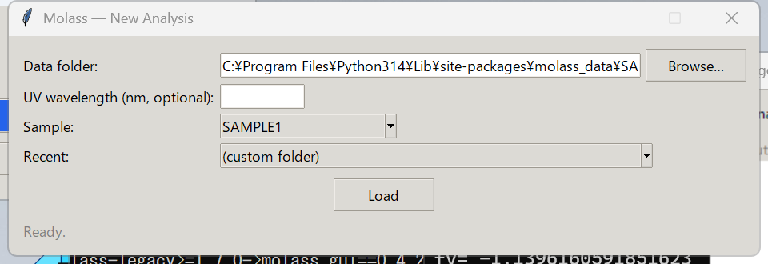
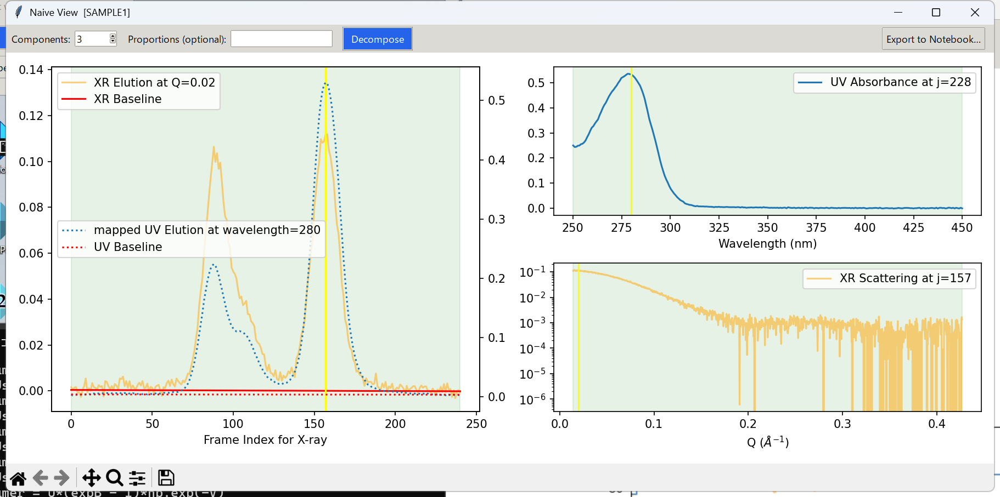
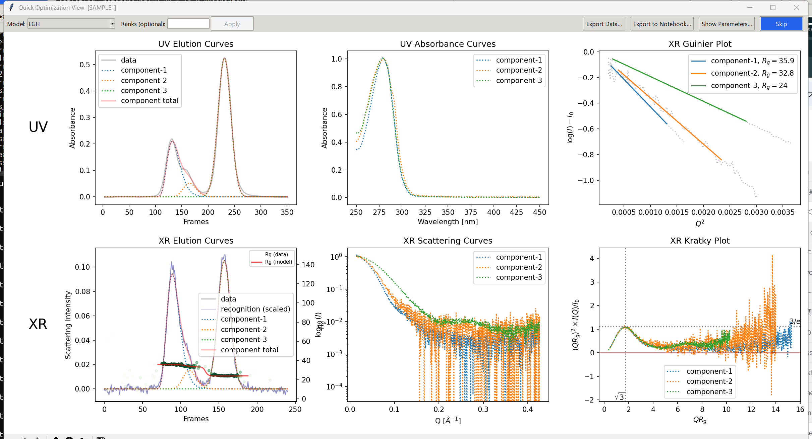
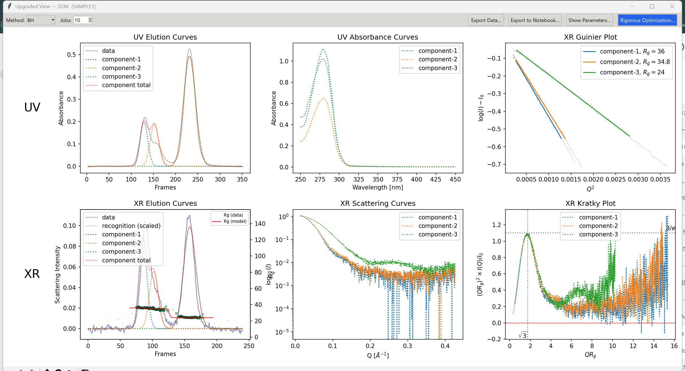
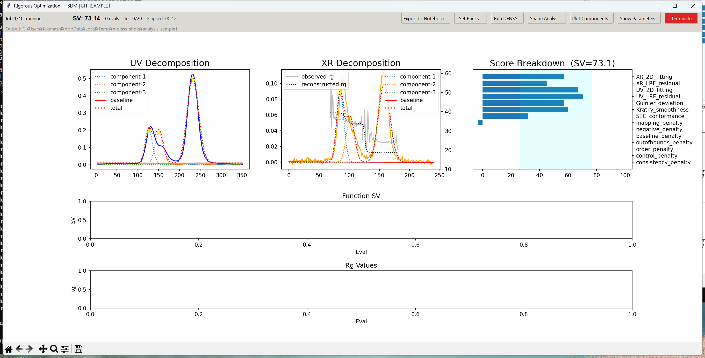

# Quick Start: Your First Analysis

This walks through a complete SEC-SAXS decomposition from a cold start,
using the sample dataset (`SAMPLE1`) bundled with the portable download, so
you can follow along immediately — no data of your own required yet.

If you haven't installed Molass GUI, see [Installation](installation.md)
first.

## What you'll see at the end

A two-component mixture resolved into separate scattering profiles for
each component, cross-checked against each component's radius of gyration
($R_g$) — the same kind of result you'd get from the
[notebook/API tutorial](https://biosaxs-dev.github.io/molass-tutorial/),
but driven entirely by clicking through windows.

## 0. Launch

Double-click `molass-gui.bat`. The launcher opens:

Click **New Analysis**.

## 1. Setup: point it at your data

- **Data folder**: the folder containing your SEC-SAXS measurement files.
- **Sample**: if the bundled sample data is available (it is, in the
  portable download), pick **SAMPLE1** here instead of typing a path — it
  fills in the Data folder box for you.
- Leave **UV wavelength** blank unless you know you need a non-default
  value.

Click **Load**.

## 2. Naive View: how many components?

This is the raw data: the X-ray elution curve (orange), the UV-mapped
elution curve (blue dots), and each channel's own profile at the frame
marked by the yellow line. Molass already suggests a starting value for
**Components**, computed from the data itself — but look at the plot before
accepting it.

For `SAMPLE1`, two peaks are obviously visible — but look closely at the
left-hand peak's shoulder: there's a smaller bump riding on it. Fitting it
as part of the same component would blur two real, distinct scattering
species into one averaged profile, so set **Components** to **3**, not 2.
This is the single most important judgment call in the whole workflow —
everything downstream builds on it — and it's a judgment only you, looking
at the actual peak shape, can make well. See
[molass's own documentation](https://biosaxs-dev.github.io/molass-library/)
for how to read less obvious cases (overlapping peaks, shoulders, trailing
edges).

Click **Decompose**.

## 3. Quick Optimization View: review, then upgrade

Six panels, all from the same decomposition: elution curves and scattering
curves for both UV and X-ray channels, plus a Guinier plot ($R_g$ per
component) and a Kratky plot. The default **EGH** model is purely empirical
— a flexible peak shape with no physical column model behind it — fast, and
a reasonable sanity check, but not yet using everything Molass can do.

This is also where the small bump becomes its own labeled component
(**component-2**, orange) instead of being folded into its neighbor —
confirming that the components-count judgment call above was the right one.

To use one of Molass's physics-based column models instead (the actual
"Upgrade" in Molass's name), choose one from the **Model** dropdown — for
example **EGH → SDM (mono)**. The button in the top-right corner changes
from **Skip** to **Upgrade**. Click it.

## 4. Upgraded View: a physically-constrained fit

Same six panels, now fit with the column model you chose — in this example,
SDM (Stochastic Dispersive Model), which ties each component's elution
shape to actual column-transport physics (pore size, dispersion) rather
than an unconstrained empirical curve.

Pick an optimization **Method** (BH = Basin-Hopping, DE = Differential
Evolution — BH is a reasonable default), leave **Jobs** at its default, and
click **Rigorous Optimization…**. You'll be asked to choose an output
folder for the results — pick anywhere you like.

## 5. Rigorous Optimization View: watch it refine

This is a live monitor, not a static report. As soon as the $R_g$ curve
finishes computing, an initial score is drawn and optimization starts
automatically in the background (you don't need to click anything else) —
the panel shown here is from just a few seconds in. Watch the **Score
Breakdown** bars shrink and the two bottom history plots fill in as
iterations proceed; **Terminate** stops it early if you don't want to wait
for the full run, and **Resume** restarts a stopped run from where it left
off.

When it's done, use **Run DENSS…** for 3D shape reconstruction,
**Shape Analysis…** or **Plot Components…** to inspect the final result, or
**Export to Notebook…** at any phase to continue in a real Jupyter notebook
— the escape hatch for anything this wizard doesn't expose a button for.

## Next steps

- Try your own data instead of `SAMPLE1` — same five steps.
- Read [molass-library's documentation](https://biosaxs-dev.github.io/molass-library/)
  to understand what each of the five column models (EGH, SDM, EDM, LKM,
  GRM) actually represents physically.
- If something looks wrong or confusing, please
  [open an issue](https://github.com/biosaxs-dev/molass-gui/issues/new) —
  reports from people trying this for the first time are exactly what make
  this guide (and the program) better.
